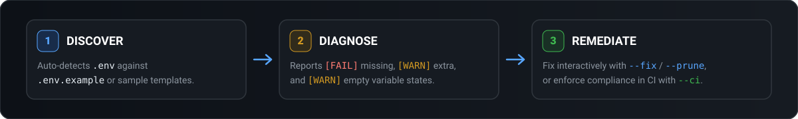

<div align="center">
  

  <h1>env-clinic</h1>

  <p>Zero-config CLI to find missing, extra, and empty variables in your .env file.</p>

  <p>
    <a href="https://www.npmjs.com/package/env-clinic">  </a>
    <a href="https://www.npmjs.com/package/env-clinic">  </a>
    <a href="https://github.com/ChloeVPin/env-clinic/actions">  </a>
    <a href="https://www.npmjs.com/package/env-clinic">  </a>
    <a href="https://github.com/ChloeVPin/env-clinic/blob/master/LICENSE">  </a>
  </p>
</div>

## Why `env-clinic`?

Deploying or starting an application with missing environment variables is one of the most common causes of runtime crashes. `env-clinic` compares your active `.env` file against `.env.example`, `.env.sample`, or `.env.template` and instantly audits for **missing**, **extra**, and **empty** variables.

It is **zero config**, lightweight, and designed to run seamlessly in both local terminal environments and automated CI/CD pipelines.

<br />

<p align="center">
  
</p>

---

## Quick Start

Run `env-clinic` in your project root:

```bash
npx env-clinic
```

It automatically auto-detects `.env` against the first available reference file (`.env.example`, `.env.sample`, or `.env.template`).

### Sample Terminal Output

```text
  [PASS] DATABASE_URL        - present
  [FAIL] STRIPE_SECRET_KEY   - MISSING (in example but not in .env)
  [WARN] OLD_REDIS_URL       - EXTRA (in .env but not in example)
  [WARN] DEBUG_MODE          - EMPTY (present but has no value)

  Tip: run with --fix to fill these in interactively.
```

---

## Interactive Remediation (`--fix` & `--prune`)

`env-clinic` goes beyond reporting by offering interactive writing modes to fix your environment files directly:

```bash
# Fill in missing variables interactively with example suggestions
npx env-clinic --fix

# Remove extra or orphaned variables interactively
npx env-clinic --prune
```

> **Safety Guarantee**: Write modes are strictly interactive and are safely rejected when executed with `--ci`, `--json`, or in non-interactive shell environments.

---

## Options & Reference Flags

| Flag | Description | Example |
|---|---|---|
| `--fix` | Interactively prompts to fill in missing variables using reference defaults as hints. | `npx env-clinic --fix` |
| `--prune` | Interactively prompts to safely remove extra variables not present in the reference file. | `npx env-clinic --prune` |
| `--ci` | Non-interactive plain text output for CI pipelines (exits with code `1` if missing). | `npx env-clinic --ci` |
| `--strict` | Strict mode: treats empty variables as errors and fails CI. | `npx env-clinic --strict` |
| `--quiet` | Suppress success logs; only display errors, warnings, and summary statistics. | `npx env-clinic --quiet` |
| `--file` | Custom path to your target `.env` file. | `npx env-clinic --file .env.production` |
| `--example` | Custom path to your reference template file. | `npx env-clinic --example .env.sample` |
| `--json` | Output audit results formatted as JSON for downstream scripting and tooling. | `npx env-clinic --json` |
| `--version` | Display current `env-clinic` version. | `npx env-clinic --version` |
| `--help` | Display CLI usage help and options. | `npx env-clinic --help` |

---

## CI/CD Pipeline Integration

Enforce environment variable compliance in your GitHub Actions workflows or CI pipelines:

```yaml
- name: Check Environment Variables
  run: npx env-clinic --ci
```

`env-clinic` exits with `0` when environment variables match reference files, and exits with `1` if required variables are missing (or empty when `--strict` is enabled).

---

## Security & Privacy Guarantee

`env-clinic` parses local `.env` keys solely to compare variable existence and detect empty values. **It does not print, log, store, or transmit secret values anywhere.**

---

## Contributing

`env-clinic` is a focused, community-driven tool. Bug reports and small improvements are welcome!

- Found an issue? [Open a GitHub Issue](https://github.com/ChloeVPin/env-clinic/issues)
- Local Development: `npm install` and `npm test`
- Read the [Contributing Guide](CONTRIBUTING.md) and [Changelog](CHANGELOG.md)

---

MIT License © 2026 ChloeVPin
